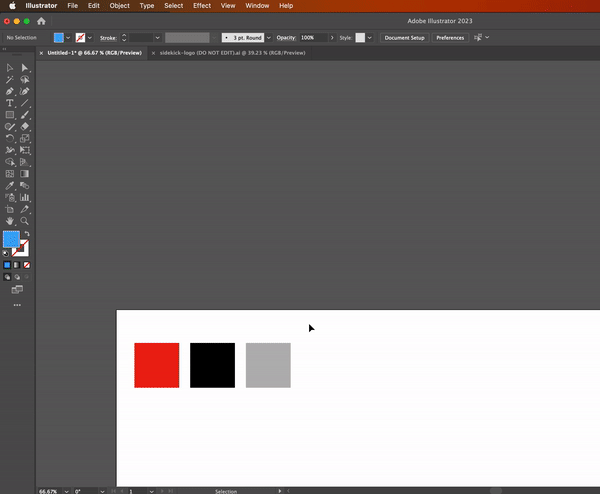

## Create Logo Swatches

This script takes the currently selected objects in a document and generates color swatches for each color, showing the RGB, CMYK, and Hex values for each color.

### Usage

1. Select any number of objects.
2. Run the script.
3. The script will create color swatches that show the color value of each swatch in RGB, CMYK, and Hex

**Note: This script only works with CompoundPathItems as the first selected object.**

### Example

