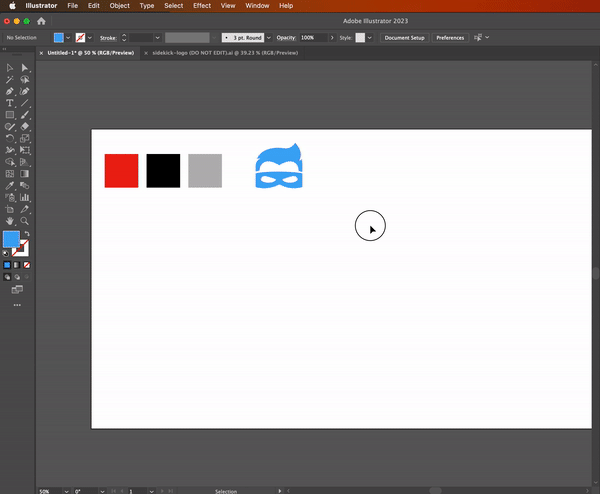

## Generate Logo Variants

This script takes the currently selected objects in a document, and if the first selected object is a CompoundPathItem,
it creates variants of that object with the fill colors from the other selected objects.

### Usage

1. Select a CompoundPathItem as the first object (highest in layers panel), and other objects with fill colors as the rest of the selection.
2. Run the script.
3. The script will create variants of the CompoundPathItem with the fill colors from the other selected objects.

**Note: This script only works with CompoundPathItems as the first selected object.**

### Example

